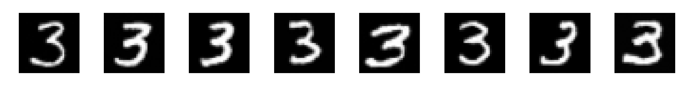

# MNIST Conditional Image Generation with Diffusion (DDPM + CFG)

This project demonstrates how to train and use a **Conditional Denoising Diffusion Probabilistic Model (DDPM)** to generate MNIST digits using **Classifier-Free Guidance (CFG)**.

---

## 🧠 Model Overview

- **Dataset**: MNIST (grayscale, 28×28 → resized to 32×32)
- **Architecture**: U-Net (`UNet2DModel`) from `diffusers`
- **Conditioning**: Class labels (digits 0–9) with label dropout during training for CFG
- **Scheduler**: DDPM scheduler with 1000 timesteps

---

## 🔥 Sample Outputs

Below are images generated for the digit **3** using CFG with `guidance_scale = 3.0`:

<p align="center">
  
</p>

---

## 🚀 How to Use

### 1. Install dependencies

```bash
pip install torch torchvision diffusers matplotlib tqdm
```

### 2. Train the model

```bash
python train_mnist_ddpm.py
```

This will save the trained model to `mnist_ddpm.pth`.

### 3. Generate images

```bash
python generate_mnist_ddpm.py
```

This script uses CFG to guide the generation toward a specific digit (customizable in the script) and saves the result to `generated_digits.png`.

---


## 📁 Files

- `train_mnist_ddpm.py` — Training script with label dropout for CFG
- `generate_mnist_ddpm.py` — Inference script with CFG support
- `mnist_ddpm.pth` — Saved model (after training)
- `generated_digits.png` — Sample generated digits

---
